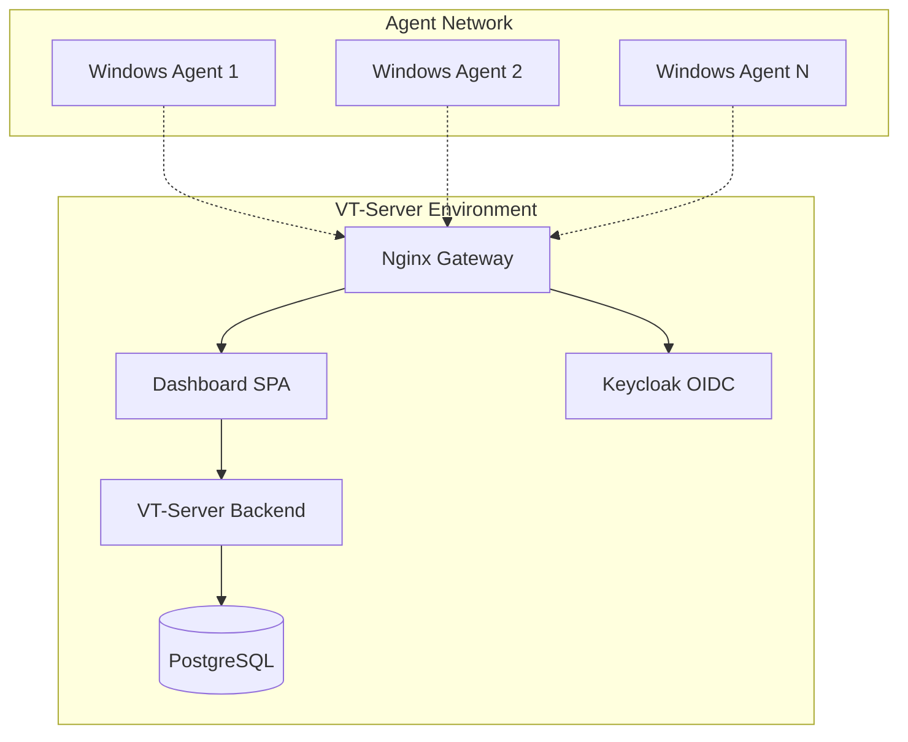

# VT-Audit - Enterprise Windows Compliance Platform

[](https://golang.org)
[](https://docker.com)
[](https://microsoft.com)
[](LICENSE)

VT-Audit là một hệ thống **enterprise-grade** để giám sát tuân thủ baseline security cho Windows workstations. Hệ thống cung cấp dashboard tập trung, agent tự động, và analytics real-time.

## ✨ Key Features

- 🎯 **Server-Controlled Scheduling**: Dashboard điều khiển polling intervals của tất cả agents
- 🔄 **Real-time Policy Updates**: Central policy management với automatic distribution
- 📊 **Multi-format Reporting**: JSON, HTML, Excel export với rich analytics
- 🛡️ **Security-First**: mTLS authentication với bypass mode for testing
- 🚀 **Zero-Touch Deployment**: Agent tự cài đặt như Windows service
- 💾 **Intelligent Caching**: Offline operation với policy caching
- 📈 **Scalable Architecture**: Support hàng trăm agents simultaneous

## 🏗️ System Architecture



### Component Overview
- **🌐 Dashboard**: Web UI với Alpine.js, real-time policy management
- **⚙️ VT-Server**: Go backend với REST API, multi-mode operation
- **💽 PostgreSQL**: Centralized audit storage với advanced querying
- **🔐 Authentication**: Keycloak OIDC cho dashboard, mTLS/bypass cho agents
- **🚪 Gateway**: Nginx reverse proxy với SSL termination
- **📱 Windows Agent**: Service mode với health checks và smart retry

## � Quick Start

### Prerequisites
- **Docker & Docker Compose** (for server environment)
- **Go 1.21+** (for building agent)
- **Windows 10/11** (for agent deployment)
- **PowerShell** (for automation scripts)

### Server Setup

```bash
# 1. Clone repository
git clone https://github.com/your-org/vt-audit.git
cd vt-audit

# 2. Start server environment
cd env
docker compose up -d

# 3. Access dashboard
open https://localhost:8443
# Login: admin / admin123
```

### Agent Deployment

```bash
# 1. Build agent
go build -o agent.exe ./agent/cmd/vt-agent

# 2. Configure agent
# Edit distribute/agent.conf with your server IP

# 3. Install as Windows service
sc.exe create VT-Agent binPath="C:\path\to\agent.exe --service --skip-mtls" start=auto DisplayName="VT Compliance Agent"
sc.exe start VT-Agent
```

### Quick Test

```bash
# Test agent locally
.\agent.exe --once --skip-mtls --html

# Test agent connectivity
.\agent.exe --local --json --server https://your-server:8443/agent
```

## 📊 Dashboard Features

### Policy Management
- ⚙️ **Centralized Policies**: Manage Windows compliance rules từ web interface
- 🕐 **Interval Control**: Set polling intervals per agent group (5min - 24h)
- 📋 **Rule Templates**: Pre-built baseline templates cho different security levels
- 🔄 **Live Updates**: Policy changes propagate to agents automatically

### Results Analytics
- 📈 **Real-time Dashboards**: Agent status và compliance metrics
- 🔍 **Advanced Filtering**: Search by hostname, time range, compliance status
- 📊 **Trend Analysis**: Historical compliance trends và improvement tracking
- 📱 **Export Options**: JSON, HTML, Excel reports với custom formatting

### Agent Management
- 🖥️ **Fleet Overview**: All connected agents với last-seen status
- 🔧 **Remote Control**: Start/stop audit cycles, update intervals
- 🏥 **Health Monitoring**: Agent connectivity, version tracking, error reporting
- 📍 **Group Management**: Organize agents by location, department, compliance level
```

### Bước 4: Kiểm tra services
```bash
# Kiểm tra tất cả containers đang chạy
docker ps

# Kiểm tra logs
docker logs vt-nginx
docker logs vt-api-agent
docker logs vt-api-backend
docker logs postgres
```

### Bước 5: Truy cập Dashboard
- Mở browser: https://localhost:443
- Login với Keycloak credentials (admin/admin)
- Dashboard hiển thị policy editor và audit results

## 🤖 Sử dụng Agent

### Build Agent
```bash
# Từ thư mục gốc
go build -o agent.exe ./agent/cmd/vt-agent
```

### Các mode chạy Agent

#### 1. Local Mode (Fetch Policy, Run Local, No Submit)
Fetch policy từ server, chạy audit local, không gửi results:
```bash
.\agent.exe --local --html --skip-mtls
```
- Kết nối server để lấy policy mới nhất
- Chạy audit trên máy local
- Tạo file HTML report để xem kết quả
- KHÔNG gửi results lên server

#### 2. Once Mode (Fetch Policy, Run Once, Submit Results)
Fetch policy từ server, chạy audit, gửi results lên server:
```bash
.\agent.exe --once --skip-mtls
```
- Kết nối server để lấy policy mới nhất
- Chạy audit một lần duy nhất
- Gửi kết quả audit lên server
- Thoát sau khi hoàn thành

#### 3. Service Mode (Continuous Periodic Audits)
Chạy như Windows service với interval điều khiển từ server:

**Manual Installation (Recommended):**
```cmd
# Chạy PowerShell as Administrator
sc.exe create VT-Agent binPath= "C:\Path\To\agent.exe --service --skip-mtls" start= auto DisplayName= "VT Compliance Agent"
sc.exe start VT-Agent

# Kiểm tra service status
sc.exe query VT-Agent
```

**Service Features:**
- 🔍 **Health Check tự động**: Kiểm tra server connection, interval changes, policy version
- ⏱️ **Server-controlled interval**: Dashboard control polling frequency (5m, 10m, 1h, etc.)
- 📋 **Smart caching**: Chỉ fetch policy khi version thay đổi
- 🔄 **Dynamic updates**: Tự động update interval khi admin thay đổi từ dashboard
- 🛡️ **Graceful fallback**: Sử dụng cache khi server unreachable
Chạy agent như Windows service với audit định kỳ:
```bash
.\agent.exe --service --skip-mtls
```
- Chạy liên tục với interval do server hardcode (1 giờ)
- Tự động fetch policy mới nhất từ server
- Gửi results lên server theo định kỳ
- Phù hợp cho production deployment

#### 4. Service Installation (Windows Service Deployment)
Cài đặt và chạy agent như Windows service:
```bash
# Cài đặt service
.\agent.exe --install

# Khởi động service 
sc start VT-Agent

# Kiểm tra status
sc query VT-Agent

# Gỡ cài đặt service
.\agent.exe --uninstall
```

#### 5. Production Mode (Full mTLS Authentication)
```bash
# Production với mTLS certificates
.\agent.exe --once

# Hoặc production service mode
.\agent.exe --service
```

#### 6. Custom Server Endpoint
```bash
.\agent.exe --server https://your-server:8443/agent --once --skip-mtls
```

### Tham số Agent

| Tham số | Mô tả | Ví dụ |
|---------|-------|-------|
| `--local` | Fetch policy, run audit locally, no submit | `--local --html` |
| `--once` | Fetch policy, run once, submit results | `--once` |
| `--service` | Run as Windows service (periodic) | `--service` |
| `--install` | Install as Windows service | `--install` |
| `--uninstall` | Uninstall Windows service | `--uninstall` |
| `--html` | Create HTML report (with --local) | `--local --html` |
| `--json` | Create JSON report (with --local) | `--local --json` |
| `--excel` | Create Excel report (with --local) | `--local --excel` |
| `--skip-mtls` | Skip mTLS authentication (testing) | `--skip-mtls` |
| `--server URL` | Custom server endpoint | `--server https://server:8443/agent` |
| `--bootstrap-token TOKEN` | Bootstrap OTT token | `--bootstrap-token 123456` |

## 🔧 Cấu hình

### Agent Configuration
- **Policy source**: Luôn fetch từ server (không có local policy files)
- **Policy cache**: `data/policy_cache.json` (tự động tạo)
- **Log file**: `agent.log` (hoặc Program Files cho service)
- **Default server**: `https://127.0.0.1:8443/agent`
- **Bootstrap token**: `123456` (mặc định)
- **Service interval**: 1 giờ (server hardcoded)

### Server Configuration
- Database: PostgreSQL với schema `audit`
- Tables: `agents`, `runs`, `check_results`, `results_flat`
- mTLS bypass mode với header `X-Test-Mode: true`

## 📊 Database Schema

```sql
-- Bảng agents
CREATE TABLE audit.agents (
    id TEXT PRIMARY KEY,
    hostname TEXT,
    os TEXT,
    created_at TIMESTAMP DEFAULT NOW(),
    last_seen TIMESTAMP DEFAULT NOW()
);

-- Bảng runs
CREATE TABLE audit.runs (
    id TEXT PRIMARY KEY,
    agent_id TEXT REFERENCES audit.agents(id),
    created_at TIMESTAMP DEFAULT NOW()
);

-- Bảng check_results
CREATE TABLE audit.check_results (
    id SERIAL PRIMARY KEY,
    run_id TEXT REFERENCES audit.runs(id),
    policy_id TEXT,
    rule_id TEXT,
    title TEXT,
    severity TEXT,
    status TEXT,
    expected TEXT,
    reason TEXT,
    fix TEXT
);

-- View results_flat
CREATE VIEW audit.results_flat AS 
SELECT ...
```

## 🔍 Troubleshooting

### Agent Issues

#### Agent không kết nối được server
```bash
# Kiểm tra server có chạy không
docker ps | findstr nginx

# Test connectivity
curl -k https://127.0.0.1:8443/agent/health
```

#### Authentication failed
```bash
# Dùng skip-mtls mode để test
.\agent.exe --skip-mtls --once --debug

# Kiểm tra logs
docker logs vt-api-agent
```

#### Policy fetch failed
```bash
# Kiểm tra api-agent service
docker logs vt-api-agent

# Test policy endpoint
curl -k -H "X-Test-Mode: true" https://127.0.0.1:8443/agent/policies
```

### Server Issues

#### Database connection failed
```bash
# Kiểm tra PostgreSQL
docker logs postgres

# Test database connection
docker exec -it postgres psql -U postgres -d vtaudit
```

#### Nginx routing issues
```bash
# Kiểm tra nginx config
docker exec vt-nginx nginx -t

# Restart nginx
docker restart vt-nginx
```

#### Certificate issues
```bash
# Regenerate certificates
cd env
./scripts/generate-mtls-assets.sh
./scripts/issue-nginx-cert.sh
docker restart vt-nginx
```

## 📝 Development

### Build từ source
```bash
# Build agent
go build -o agent.exe ./agent/cmd/vt-agent

# Build server
cd env
docker compose build
```

### Logs và Debugging
```bash
# Agent logs
tail -f agent.log

# Server logs
docker logs -f vt-api-agent
docker logs -f vt-api-backend
docker logs -f vt-nginx

# Database logs
docker logs -f postgres
```

### Testing Flow
1. Chạy `.\agent.exe --local --html --skip-mtls` để test local audit
2. Chạy `.\agent.exe --once --skip-mtls` để test với server submission
3. Kiểm tra dashboard tại https://localhost:443
4. Xem results trong PostgreSQL
5. Cài đặt production: `.\agent.exe --install` và `sc start VT-Agent`

## 🔐 Security

- **Server-Controlled Policy**: Agent luôn fetch policy từ server, không có local files
- **mTLS Authentication**: Client certificates cho production mode
- **Bypass Mode**: Test mode với header `X-Test-Mode: true` và `--skip-mtls`
- **OIDC Integration**: Keycloak authentication cho dashboard
- **TLS Encryption**: Tất cả communications đều encrypted
- **Centralized Management**: Tất cả policy và configuration từ server

## 📖 API Endpoints

### Agent API (port 8443)
- `GET /agent/policies` - Lấy policy hiện tại
- `POST /agent/results` - Gửi audit results
- `POST /agent/bootstrap/ott` - Bootstrap với OTT token
- `POST /agent/enroll` - Enroll để lấy certificate

### Dashboard API (port 443)
- `GET /api/dashboard` - Dashboard data
- `GET /api/policy` - Policy management
- `POST /api/auth/login` - Authentication

## 🤝 Contributing

1. Fork repository
2. Tạo feature branch
3. Commit changes
4. Push và tạo Pull Request

## 📄 License

[License information here]
