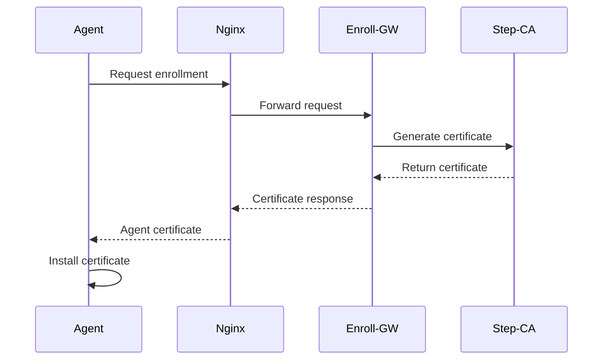
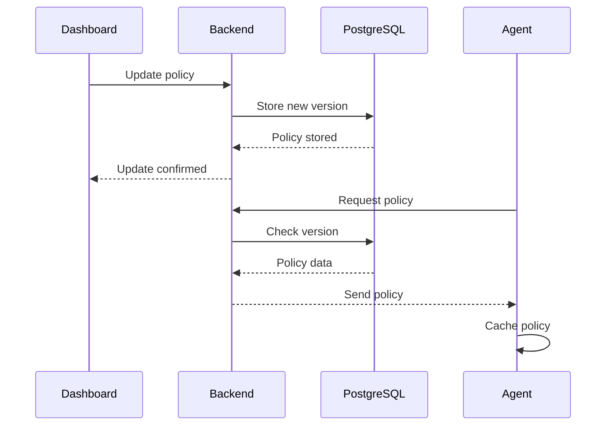
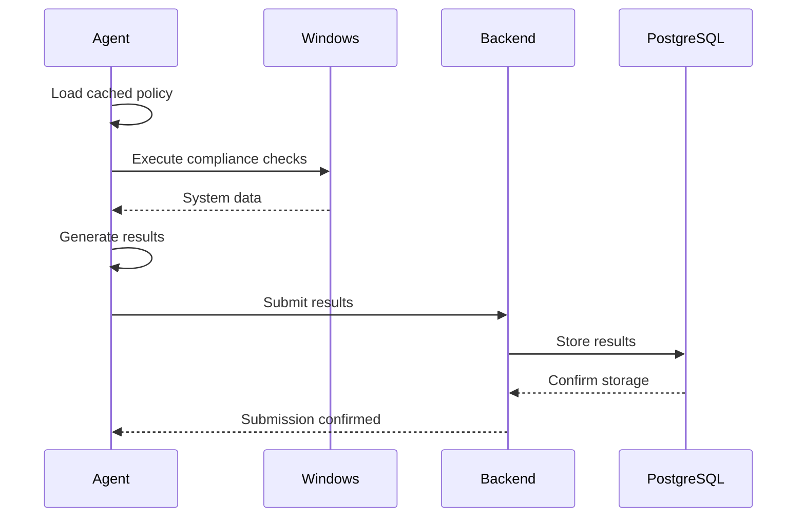

# VT-Audit System Architecture

## 🎯 Design Principles

VT-Audit được thiết kế dựa trên các nguyên tắc sau:

- **🏢 Enterprise-First**: Scalable cho số lượng lớn Windows workstations
- **🔒 Security-Centric**: Defense-in-depth với mTLS, OIDC, và certificate management
- **📊 Data-Driven**: Centralized analytics với rich querying capabilities
- **🔄 Zero-Touch**: Minimal manual intervention cho deployment và maintenance
- **⚡ Performance**: Efficient polling với smart caching và batch operations
- **🛡️ Resilient**: Graceful degradation và offline operation capabilities

## 🏗️ High-Level Architecture

```
                    ┌─────────────────────────────────────────┐
                    │              VT-Server Stack            │
                    │  ┌─────────┐ ┌─────────┐ ┌─────────┐   │
Internet/Corporate  │  │Dashboard│ │API-Agent│ │Enroll-GW│   │
Network            ◄┼─►│  :8081  │ │  :8080  │ │  :9000  │   │
                    │  └─────────┘ └─────────┘ └─────────┘   │
                    │  ┌─────────┐ ┌─────────┐ ┌─────────┐   │
                    │  │ Nginx   │ │Keycloak │ │PostgreSQL   │
                    │  │ :443/   │ │ :8080   │ │  :5432  │   │
                    │  │ :8443   │ │         │ │         │   │
                    │  └─────────┘ └─────────┘ └─────────┘   │
                    └─────────────────────────────────────────┘
                                        ▲
                                        │ HTTPS/mTLS
                                        ▼
          ┌─────────────┐    ┌─────────────┐    ┌─────────────┐
          │ VT-Agent    │    │ VT-Agent    │    │ VT-Agent    │
          │ Windows-1   │    │ Windows-2   │    │ Windows-N   │
          │ Service     │    │ Service     │    │ Service     │
          └─────────────┘    └─────────────┘    └─────────────┘
```

## 🔧 Component Deep Dive

### 1. VT-Agent (Windows Service)

**Purpose**: Compliance data collection và submission từ Windows workstations

**Core Functions**:
```go
// Main execution modes
- Local Mode:     .\agent.exe --local --html
- Once Mode:      .\agent.exe --once --skip-mtls  
- Service Mode:   sc.exe start VT-Agent
- Continuous:     .\agent.exe --server https://...
```

**Key Features**:
- **🔄 Smart Polling**: Server-controlled intervals (5m-24h)
- **💾 Policy Caching**: Offline operation với cached policies
- **🏥 Health Checks**: Automatic server connectivity monitoring
- **📊 Multi-format Output**: JSON, HTML, Excel reporting
- **🛡️ Auth Flexibility**: mTLS certificates hoặc bypass mode
- **🔧 Service Integration**: Full Windows Service lifecycle

**Architecture Patterns**:
```go
// Plugin-based compliance checking
type ComplianceChecker interface {
    Check(policy Policy) Result
}

// Modular collectors
- RegistryCollector
- FileSystemCollector  
- ServiceCollector
- ProcessCollector
- SecurityPolicyCollector
```

### 2. VT-Server Backend

**Purpose**: Central coordination, policy management, và data aggregation

**Multi-Mode Operation**:
```bash
# Dashboard mode - Web UI và management API
./vt-server --mode=dashboard --port=8081

# Agent mode - Agent communication endpoint  
./vt-server --mode=agent --port=8080

# Enrollment mode - Certificate issuance
./vt-server --mode=enroll --port=9000
```

**Key Components**:

#### Dashboard Service (`pkg/dashboard/`)
- **Authentication**: OIDC integration với Keycloak
- **Policy Management**: CRUD operations cho compliance rules
- **Agent Fleet**: Real-time agent status và control
- **Analytics**: Compliance trends và reporting
- **SPA Serving**: Static file serving cho Alpine.js frontend

#### Agent API Service (`pkg/httpagent/`)
- **Policy Distribution**: Versioned policy serving với caching
- **Result Collection**: Bulk audit result ingestion
- **Health Endpoints**: Agent connectivity monitoring
- **Interval Management**: Dynamic polling control

#### Enrollment Service (`pkg/stepca/`)
- **Certificate Authority**: Integration với Step-CA
- **Agent Enrollment**: Automated certificate provisioning
- **mTLS Management**: Certificate lifecycle management

### 3. Data Layer (PostgreSQL)

**Schema Design**:
```sql
-- Agent registry và tracking
CREATE TABLE agents (
    id SERIAL PRIMARY KEY,
    hostname VARCHAR(255) UNIQUE NOT NULL,
    first_seen TIMESTAMP DEFAULT NOW(),
    last_seen TIMESTAMP DEFAULT NOW(),
    version VARCHAR(50),
    os_version VARCHAR(100),
    status VARCHAR(50) DEFAULT 'active',
    group_name VARCHAR(100),
    location VARCHAR(100)
);

-- Compliance audit results
CREATE TABLE audit_results (
    id SERIAL PRIMARY KEY,
    agent_id INTEGER REFERENCES agents(id),
    policy_version INTEGER NOT NULL,
    rule_id VARCHAR(100) NOT NULL,
    title VARCHAR(500) NOT NULL,
    description TEXT,
    status VARCHAR(20) NOT NULL, -- PASS/FAIL/ERROR
    actual_value TEXT,
    expected_value TEXT,
    severity VARCHAR(20), -- LOW/MEDIUM/HIGH/CRITICAL
    category VARCHAR(50), -- SECURITY/COMPLIANCE/CONFIGURATION
    timestamp TIMESTAMP DEFAULT NOW(),
    
    INDEX idx_agent_timestamp (agent_id, timestamp),
    INDEX idx_status_severity (status, severity),
    INDEX idx_policy_version (policy_version)
);

-- Policy management
CREATE TABLE policies (
    id SERIAL PRIMARY KEY,
    version INTEGER UNIQUE NOT NULL,
    name VARCHAR(200) NOT NULL,
    description TEXT,
    content JSONB NOT NULL,
    created_by VARCHAR(100),
    created_at TIMESTAMP DEFAULT NOW(),
    active BOOLEAN DEFAULT FALSE,
    
    INDEX idx_version (version),
    INDEX idx_active (active)
);

-- Agent configuration
CREATE TABLE agent_configs (
    id SERIAL PRIMARY KEY,
    agent_id INTEGER REFERENCES agents(id),
    polling_interval INTEGER DEFAULT 600, -- seconds
    enabled_rules JSONB, -- array of rule IDs
    custom_settings JSONB,
    updated_at TIMESTAMP DEFAULT NOW()
);
```

**Performance Optimizations**:
- **Partitioning**: audit_results table partitioned by month
- **Indexing**: Composite indexes for common query patterns
- **Connection Pooling**: pgbouncer integration
- **Read Replicas**: For analytics workloads

### 4. Security Layer

#### Authentication & Authorization
```yaml
# Keycloak OIDC Integration
Dashboard Access:
  - Authentication: OIDC với Keycloak
  - Authorization: Role-based (admin, operator, viewer)
  - Session Management: JWT tokens với refresh

Agent Authentication:
  - Primary: mTLS certificates từ Step-CA
  - Fallback: Bearer token bypass mode
  - Certificate Rotation: Automatic với Step-CA
```

#### Network Security
```yaml
# Nginx Gateway Configuration
SSL/TLS:
  - TLS 1.3 preferred
  - Strong cipher suites only
  - HSTS headers
  - Certificate pinning

Reverse Proxy:
  - Request routing dựa trên path
  - Rate limiting
  - Request size limits
  - Security headers injection
```

#### Certificate Management
```yaml
# Step-CA Integration
Root CA: 
  - Self-signed root certificate
  - Stored in secure location
  - Backup và recovery procedures

Intermediate CA:
  - Issued by root CA
  - Used for agent certificates
  - Automatic rotation

Agent Certificates:
  - Short-lived (24-48h)
  - Automatic renewal
  - Revocation support
```

## 🔄 Data Flow Patterns

### 1. Agent Enrollment Flow


### 2. Policy Distribution Flow


### 3. Audit Execution Flow


## 📊 Scalability Considerations

### Horizontal Scaling
- **Agent Support**: Designed for 1000+ concurrent agents
- **Database Sharding**: Partition strategies cho large datasets
- **Load Balancing**: Multiple backend instances behind nginx
- **Microservices**: Each server mode có thể scale independently

### Performance Metrics
- **Agent Throughput**: 100+ agents per backend instance
- **Response Time**: <200ms for policy requests
- **Data Ingestion**: 10,000+ results/minute
- **Storage Growth**: ~1GB/month per 100 agents

### Monitoring & Observability
```yaml
Metrics Collection:
  - Prometheus metrics trong server
  - Agent performance counters
  - Database query performance
  - Network latency tracking

Logging Strategy:
  - Structured JSON logging
  - Centralized log aggregation
  - Error tracking và alerting
  - Audit trail cho compliance

Health Checks:
  - Service health endpoints
  - Database connectivity checks
  - Certificate expiration monitoring
  - Agent last-seen tracking
```

## 🛠️ Deployment Patterns

### Development Environment
```yaml
Configuration:
  - Docker Compose với hot-reload
  - Local certificate generation
  - Mock authentication
  - In-memory caching

Development Tools:
  - Go air for hot-reload
  - Database migrations
  - Test data seeding
  - Local HTTPS setup
```

### Production Environment  
```yaml
Infrastructure:
  - Kubernetes deployment
  - Persistent volume storage
  - External PostgreSQL cluster
  - Certificate management automation

Security Hardening:
  - Network policies
  - Resource limits
  - Security contexts
  - Regular security scans
```

### High Availability
```yaml
Redundancy:
  - Multiple backend replicas
  - Database clustering
  - Load balancer failover
  - Geographic distribution

Backup Strategy:
  - Database point-in-time recovery
  - Certificate backup
  - Configuration backup
  - Disaster recovery procedures
```

## 🔮 Future Architecture Evolution

### Planned Enhancements
- **Multi-tenancy**: Support cho multiple organizations
- **Plugin System**: Custom compliance checks
- **Real-time Streaming**: WebSocket agent communication
- **AI/ML Integration**: Anomaly detection và predictive analytics
- **Multi-platform**: Linux và macOS agent support

### Technology Roadmap
- **Event Sourcing**: Audit trail improvements
- **CQRS**: Separate read/write models
- **GraphQL**: Flexible API queries
- **Service Mesh**: Enhanced service communication
- **Edge Computing**: Local policy caching nodes

---

*Architecture documentation nên được review và update thường xuyên khi system evolves và requirements change.*